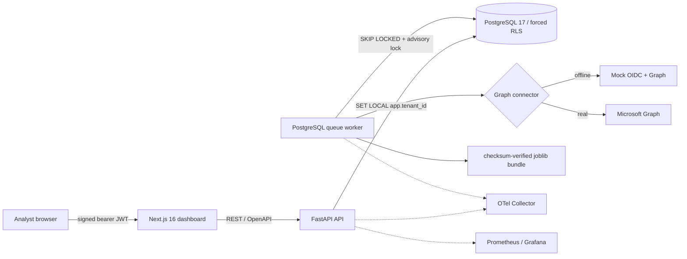

# Architecture and data flow

## Runtime topology

The API derives the tenant only from a verified `tid` claim. Every application transaction sets `app.tenant_id`; PostgreSQL then enforces and forces the matching policy on all fourteen business tables. The worker uses the administrative database role only to claim jobs and perform retention. Actual tenant processing runs through the same transaction-scoped RLS context as API requests.

## Ingestion sequence

1. An idempotent sync job is inserted in PostgreSQL.
2. A worker claims it with `FOR UPDATE SKIP LOCKED`, then obtains a tenant advisory lock.
3. The selected connector gets users, MFA registration/capability, optional risky-user signals, directory-role membership, bounded sign-ins, optional Defender alerts, and inbox delta pages using exact projections and immutable IDs.
4. Message metadata is normalized to `EmailMetadataV1`; tenant-scoped hashes replace message and domain identifiers. Subject, body, preview, unique body, and attachment bytes are never requested or accepted.
5. The checksum-verified ONNX pipeline produces email probabilities (joblib is the verified fallback). Microsoft 365 authentication outcomes then apply an explicit evidence guard because the legacy corpus does not contain SPF/DKIM/DMARC outcome labels.
6. Risk factors, model version, delta checkpoint, audit data, and freshness timestamps are committed. The dashboard polls at five-second intervals.

## V2 canonical feature graph

PostgreSQL remains the source of truth. The investigation graph is a logical projection: employees, mail/sign-in/alert observations, canonical features, and final components are returned as nodes with traceable edges. Features are not duplicated as database nodes.

The canonical V3 runtime produces five non-overlapping components: `email_threat`, `identity_compromise`, `mfa_exposure`, `privilege_exposure`, and `endpoint_threat`. Composite authentication takes precedence over DMARC, then DKIM/SPF, so the same evidence is not counted repeatedly. An external sender alone is context, not risk. Local sign-in UEBA and Entra provider risk are fused with `max`, not added. Privilege amplifies demonstrated compromise impact and cannot create risk for a healthy administrator. Each component carries explicit `available` and `insufficient_history` states; scoring is coverage-normalized and withheld below 60% threat-evidence coverage. Historical V1 daily records remain for comparison, but only the canonical runtime writes the current dashboard score.

## Data stores and retention

| Data | Store | Default retention |
|---|---|---:|
| Raw public archives | Local ignored files | Operator managed |
| Processed public metadata | Partitioned Parquet (`dataset/date/tenant`) | Operator managed |
| Message-derived tenant features | PostgreSQL | 180 days |
| Pseudonymous sign-in observations | PostgreSQL | 180 days |
| Pseudonymous security alerts and V2 feature windows | PostgreSQL | 365 days |
| Daily aggregates, risk, feedback, audit, completed jobs | PostgreSQL | 365 days |
| Model bundles and reports | Local/GitHub release artifacts | Version policy |

Connector secrets are AES-GCM encrypted with tenant ID as authenticated associated data. The master key exists only in the environment. Model artifacts are hash-verified before joblib deserialization; production refuses missing or unapproved manifests.

## Deployment modes

- `CONNECTOR_MODE=mock`: two tenants, 100 users each, 90 days of history, local OIDC/JWKS, two-second mail generation, attack and failure controls.
- `CONNECTOR_MODE=real`: mock administration returns 404; the worker decrypts only the current tenant’s consented client secret and uses the concrete tenant token authority.
- `APP_ENV=production`: mock mode, default secrets, missing Graph credentials, and demo/unapproved models prevent startup/readiness.

Azure hosting is deliberately excluded. Tagged releases contain architecture-specific loadable images, Compose, migrations, checksums, SBOMs, the approved model manifest, installer, backup/restore, and rollback tooling.
